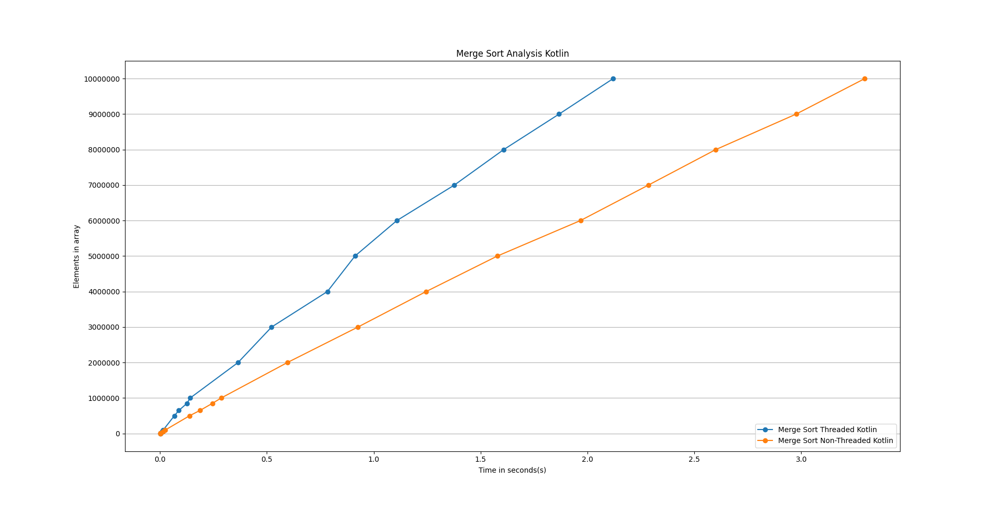

# Operating Systems Project Spring 2023
## Comparison of sorting algorithms in android using threads

This project was undertaken by 3 studens from FAST National University. Our goal was to analyze the use of multiple threads in sorting algorithms. We wanted to see if android applications can utilize their multicore processors in speeding up the sorting time of arrays. We have implemented two sorting algorithms in this project, Merge Sort and Quick Sort. Both of these algorithms have their threaded and non-threaded versions. The merge sort algorithm was written in Kotlin while Quick Sort algorithm was written in C++.

## Merge Sort

We first compared the threaded version of merge sort with the non threaded version of merge sort. The total number of threads available on my device were 8 so this analysis uses the threaded version of merge sort with 8 threads.

We can see from the above graph that as the size of our array increased the time difference between the threaded and non-threaded version also increased. We were not able to test with more data due to either the limit of the android phone or due to a bug in the application as we could not create an array greater than 17 million integers. The divide and conquer approach of the merge sort algorithm is the reason we can see a difference in time between the threaded and non-threaded version of the algorithm. As the array size increased, the algorithm divided the arrays into subarrays between threads which resulted in quicker sorting. When sorting data of 10 million arrays we can see a 1 second difference between both the merge sort versions.

## Quick Sort Analysis

---

This analysis was the most intriguing as the code for both the threaded and non-threaded versions of Quick Sort was written in C++ using Java Native Interface (JNI). We passed our kotlin array to C++ which converted the `jintArray` to a C++ compatible array which was sorted using Quick Sort.

Below is a graph of Quick Sort Analysis:

*Fig 2) Shows a line graph of threaded and non-threaded Quick Sort*

There was a significant difference between the threaded and non-threaded versions of Quick Sort. The reason could be that Quick Sort has a worst-case complexity of O(N^2) but we used the lowest time recorded to sort the array to disregard. As our array grew larger the time difference increased as well, there was a 5-second difference between both the threaded and non-threaded versions of Quick Sort.

## Sorting Analysis

---

We finally compare both our sorting algorithms with their threaded and non-threaded versions and here is the output:

*Fig 3) Shows a line graph of threaded and non-threaded versions of both Quick Sort and Merge Sort*

We can see that our threaded version of Quick Sort gave the most optimal performance since it ran natively using C++ and was compiled by the operating system, while the threaded version of Merge Sort was slower than the threaded version of Quick Sort because it ran on JVM which adds an extra layer between the of computing on the hardware.

## Conclusion
---
We have seen the performance of our sorting algorithms with and without threads. We also analyzed the performance of native and non-native code and could see that using threads gave us a significant performance boost to using a sequential algorithm. We should also consider that if we write our algorithms in native code such as C++ we can improve the performance of our application significantly as compared to running the code on the JVM.